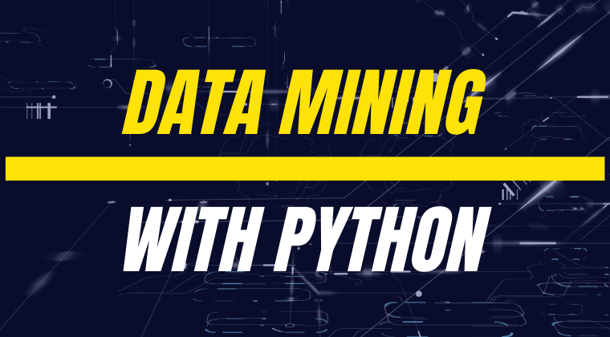

# Python pour la Data Mining 

##### 1. Introduction à la Data Mining avec Python

Dans ce quatrième chapitre, nous allons explorer les possibilités d'exploration de données (data mining)

-  Découvrir les objets Pandas DataFrame

- Calculer avec la bibliothèque Pandas

- Manipuler des données et les valeurs particulières

- Concaténer différentes sources de données

- Fusionner différentes sources de données

- Visualisation graphique des données grâce à la librairie Matplotlib

