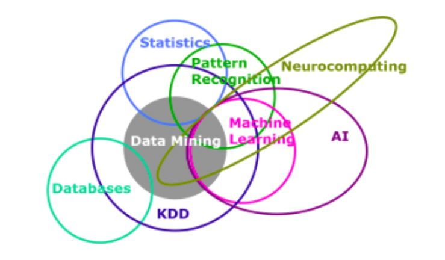

# Introduction au Data Mining et à l'apprentissage statistique

```{admonition} <font color='blue'>Data Mining</font>
:class: tip
Le data mining, parfois appelé **fouille de données**, consiste à explorer et analyser de vastes ensembles de données afin de découvrir des schémas, des tendances ou des relations significatives qui peuvent être cachées. 

Ce processus fait appel à des méthodes informatiques et statistiques pour filtrer, trier et analyser les données brutes, avec pour objectif d'identifier des modèles exploitables. Les données utilisées peuvent provenir de diverses sources telles que des bases de données, des entrepôts de données, des médias sociaux ou des capteurs. Les techniques de data mining incluent la classification, la régression, le clustering, l'association et la détection d'anomalies, entre autres.

```




Voici quelques exemples d'application du data mining : 
- Banque et finance : Détection de fraude, Évaluation du risque de crédit, minimisation de risques financiers
- Santé : Diagnostic médical, Prévention des maladies, 
- Marketing et publicité en ligne : Ciblage publicitaire, Analyse des sentiments
- Industrie manufacturière :Maintenance prédictive,  Optimisation de la chaîne d'approvisionnement
- Sécurité : Analyse des empreintes digitales, Analyse des vidéos de surveillance

```{admonition} Processus de data mining
La mise en œuvre d'un projet de data mining suit généralement plusieurs étapes clés. En 1996, un groupe d’analystes définit le data mining comme étant un processus composé de cinq étapes sous le standard **CRISP-DM** (Cross-Industry Standard Process for Data Mining)
1. Définition des objectifs et comprendre le phénomène
2. Collecte de données
3. Pré-traitement
4. Analyse statistique (Estimation du modèle)
5. Interpréter le modèle et Évaluer ses capacités
```

```{admonition} <font color='blue'>Types d'apprentissage statistique</font>
:class: tip
On distingue entre :

- L'apprentissage supervisé consiste à entraîner un modèle à prédire ou à classifier de nouvelles données en se basant sur des exemples déjà étiquetés.

- L'apprentissage non supervisé cherche à découvrir des structures cachées ou des schémas intrinsèques dans les données en utilisant des données non étiquetées.

- L'apprentissage par renforcement implique que le modèle apprend à prendre des décisions en interagissant avec un environnement, cherchant à maximiser une récompense donnée.
```

```{admonition} Domaines d'application du data mining

```

```{admonition} Processus et méthodologie du data mining
```

```{admonition} Techniques du data mining
Le DM est un processus utilisé pour découvrir des modèles, des corrélations ou des tendances significatives dans de grandes quantités de données. On pratique, on distingue entre 6 techniques du DM :

1. Description
2. Classification
3. Association
4. Estimation
5. Segmentation
6. Prévision.

Chacune de ces techniques est utilisée pour explorer et analyser des données dans le but de trouver des informations utiles et des tendances cachées. 

Ces six méthodes d'analyse peuvent être classées en techniques descriptives (Description, Classification, Association) et prédictives (Estimation, Segmentation, Prévision).

```

```{admonition}  Statistique vs Data mining
La statistique et le data mining sont deux domaines connexes mais distincts dans l'analyse des données :

Statistique : Elle se concentre sur la collecte, l'analyse et l'interprétation de données pour comprendre des phénomènes, évaluer des hypothèses et prendre des décisions fondées sur des probabilités. Les méthodes statistiques traditionnelles incluent des techniques telles que les tests d'hypothèses, l'analyse de variance et la régression linéaire.

Data mining : Il se focalise sur l'exploration et l'analyse de grandes quantités de données pour découvrir des modèles, des tendances et des relations significatives. Contrairement à la statistique traditionnelle, le data mining met souvent l'accent sur la prédiction et la découverte de structures cachées dans les données sans hypothèses préalables. Les techniques de data mining comprennent la classification, la régression, le regroupement et l'analyse de séquence.
```