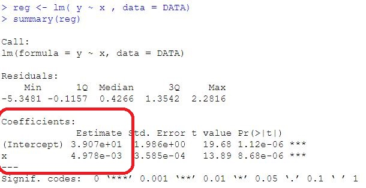
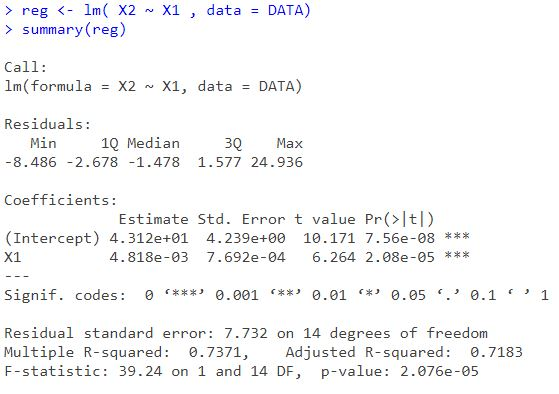

### Régression linéaire simple avec Python

#### 1. Eléments théoriques

##### 1.1. Présentation

```{admonition} Régression linéaire simple
*La régression linéaire simple (RLS)* permet d’étudier la liaison (supposée linéaire) entre deux variables quantitatives x et y où la variable y ( dite variable endogène) sera expliquée par la variable x (variable exogène).

Autrement dit, on cherche à prévoir le comportement moyen de la variable aléatoire y en fonction de la variable non aléatoire x.


*Exemples : *
- La loi de la demande : 

$$
X = a - b P_X ; (a,b) \in \mathbb{R}^{2}
$$

- La Fonction de consommation : 

$$
C = a + b Y ; (a,b) \in \mathbb{R}^{2}
$$

- La Fonction de coût : 

$$
CT = a + b Q ; (a,b) \in \mathbb{R}^{2}
$$

```

```{admonition} <font color='blue'>Modèle de régression linéaire simple</font>
:class: tip

Modèle linéaire simple} est un modèle de régression linéaire avec une seule variable dite "explicative".


Soient x et y deux variables et $ \beta_{0}$, $\beta_{1}$ deux réels dans $\mathbb{R}$. Le modèle de régression simple s'écrit comme suit:

$$
y = \beta_{0} + \beta_{1}x + \epsilon
$$

- La variable y est appelée variable expliquée, variable dépendante ou encore variable endogène. 

- La variable x est appelée variable explicative, indépendante ou encore variables exogène.

- $ \beta_{0}$, $\beta_{1}$ paramètres à estimer.

- $\epsilon$ est appelé terme d'erreur ou perturbation.
```

```{admonition} Spécification
- <font color='blue'>Modèle en coup instantanée (transversal)</font>

Les variables représentent des phénomènes observés au même instant mais concernent plusieurs individus.

$$
y_{i} = \beta_{0} + \beta_{1}x_{i} + \epsilon_{i}  \qquad     ; \forall i = 1, ..., N
$$

*Exemple *

La théorie Keynésienne stipule C = f(Y) avec $f^{'}$ > 0

$$
C_{i} = \beta_{0} + \beta_{1}Y_{i} + \epsilon_{i}
$$

- <font color='blue'>Modèle chronologique (temporel)</font>


Les variables représentent des phénomènes observés à un instant de temps régulier pour le même individu.

$$
y_{t} = \beta_{0} + \beta_{1}x_{t} + \epsilon_{t} \qquad     ; \forall t = 1, ..., T
$$
*Exemple*

$$
C_{t} = \beta_{0} + \beta_{1}Y_{t} + \epsilon_{t}
$$


- <font color='blue'>Le modèle en panel (longitudinal)</font>

Les variables représentent des phénomènes observés à un instant de temps régulier pour des individus différents.

$$
y_{it} = \beta_{0} + \beta_{1}x_{it} + \epsilon_{it} \qquad     ; \forall t = 1, ..., T , \forall i = 1, ..., N
$$

Exemple :

$$
C_{it} = \beta_{0} + + \beta_{1}Y_{it} + \epsilon_{it}
$$

```

```{admonition} Hypothèses de la RLS
:class: attention
Les hypothèses de la RLS permettent de déterminer les propriétés des estimateurs et de mettre en place les outils de statistique inférentielle (tests d’hypothèses, intervalle de confiance).

Les hypothèses de la Régression Linéaire Simple peuvent être formulées, sous forme mathématique, comme suit:

-  $H_{1}$: y est linéaire en x

- $H_{2}$: E($\epsilon_{t}$) = 0 ; $\forall t = 1, 2,...T$

- $H_{3}$: V($\epsilon_{t}$) = $\sigma^{2}_{\epsilon}$ (homoscédasticité)

- $H_{4}$: cov($x_{t}, \epsilon_{t}$)= 0 

- $H_{5}$: cov($\epsilon_{t}, \epsilon_{t^{'}}$)= 0  ; $\forall t \neq t^{'}$

- $H_{6}$: $\epsilon_{t}$ $\thicksim$ N(0, $\sigma^{2}_{\epsilon}$)

```

##### 1.2. Estimation des paramètres du RLS

```{admonition} Exercice 1

* En utilisant la méthode des Moindres Carrées Ordinaires (MCO) démontrez que :

$$
\widehat{{\beta_{1}}} =  \dfrac{cov(x,y)}{v(x)}
$$

$$
\widehat{{\beta_{1}}} = \dfrac{ \sum _{t=1}^{T}(x_{t}-\overline{x})(y_{t}-\overline{y})}{ \sum _{t=1}^{T} (x_{t}-\overline{x})^{2}} 
$$

$$
\widehat{{\beta_{0}}} = \overline{y} - \widehat{{\beta_{1}}}\overline{x} 
$$

```
```{admonition} <font color='blue'>Réponse de l'exercice 1</font>
:class: attention

* On détermine la droite passant, le plus proche, de tous les points du nuage $(x_{t}, y_{t})$ 

Notons par :

- L’équation $ \widehat{{y_{t}}} = \widehat{{\beta_{0}}} + \widehat{{\beta_{1}}}x_{t}$ la droite de régression recherchée

- La valeur résiduelle $e_{t} = y_{t} - \widehat{{y_{t}}}$

**Objectif** : 

On désire résoudre le problème d'optimisation suivant (càd calculer les valeurs qui minimisent la somme des carrés des résidus).

$$
(\widehat{{\beta_{0}}}, \widehat{{\beta_{1}}}) = Arg \underset{(\beta_{0}, \beta_{1}) \in \mathbb{R}^{2}}{Min}\sum _{t=1}^{T} \epsilon^{2}_{t} 
$$

- On pose:

$$
Min  ~ S(\beta_{0},\beta_{1}) = Min \sum _{t=1}^{T} \epsilon^{2}_{t}
$$

$$
Min \sum _{t=1}^{T} \epsilon^{2}_{t} = Min \sum _{t=1}^{T} (y_{t} - \widehat{{y_{t}}})^{2} = Min  \sum _{t=1}^{T} (y_{t} - \widehat{{\beta_{0}}} - \widehat{{\beta_{1}}}x_{t})^{2} 

$$

-Conditions

Pour trouver la valeur du minimum recherché, on annule les dérivées par rapport $\beta_{0}$ et $\beta_{1}$.

$$
\dfrac{\partial S(\beta_{0},\beta_{1})}{\partial\beta_{0}} = 0
$$

$$
\dfrac{\partial S(\beta_{0},\beta_{1})}{\partial\beta_{1}} = 0
$$

Les valeurs des paramètres qui minimisent la somme des carrés des résidus sont données par les deux formules suivantes:

$$
\widehat{{\beta_{1}}} =  \dfrac{cov(x,y)}{v(x)}


\widehat{{\beta_{1}}} = \dfrac{ \sum _{t=1}^{T}(x_{t}-\overline{x})(y_{t}-\overline{y})}{ \sum _{t=1}^{T} (x_{t}-\overline{x})^{2}} 


\widehat{{\beta_{0}}} = \overline{y} - \widehat{{\beta_{1}}}\overline{x} 
$$
```


```{admonition} Exemple 1
Soit C la fonction de demande Kéynisienne telle que :

$$
C_{t} = \beta_{0} + \beta_{1}Y_{t} + \epsilon_{t} 
$$

- $C$: Consommation
- $Y$: Revenu 
- $\beta_{0}$: Consommation autonome ou incompressible
- $\beta_{1}$: Propension marginale à consommer

__Questions__

1. D'après vos connaissances en économie, qu'il est le signe attendu par le paramètre $\beta_{1}$._Justifiez votre réponse_
2. En appliquant la MCO, déterminer les valeurs de la consommation autonome et de la propension marginale à consommer
3. En déduire l'expression de la droite de régression   $\widehat{C_{t}}$

On donne : Cov(C,Y) = 0.8, V(Y)=0.4, $\overline{C}$= 140 et $\overline{Y}$ = 110.

```

```{admonition} <font color='blue'> Elements de réponse</font>
:class: attention
C est la fonction de demande Kéynisienne telle que :


$$
C_{t} = \beta_{0} + \beta_{1}Y_{t} + \epsilon_{t} 
$$
1. $\beta_{1}$ $\in$ $\mathbb{R}^{+}$ 
2. 
$$
\widehat{{\beta_{1}}} =  \dfrac{cov(C,Y)}{v(Y)} = \dfrac{0,8}{0,4}=2


\widehat{{\beta_{0}}} = \overline{C} - \widehat{{\beta_{1}}}\overline{Y} =140-2*110 = -80
$$
```


```{admonition} Exemple 2
L'analyse de certaines données macroéconomiques a donné les résultats suivants:



1. Trouver les valeurs des paramètres estimés
2. En déduire l'équation de la droite de régression
```
```{admonition} <font color='blue'> Elements de réponse</font>
:class: attention

1. D'après l'output 

$$
y_{t} = \beta_{0} + \beta_{1}x_{t} + \epsilon_{t} 
$$

$$
\widehat{{\beta_{1}}} = 4,978 e^{-3}

\widehat{{\beta_{0}}} = 3,907e^{+1}
$$
2. L'équation de la droite de régression

$$
\widehat{{y_{t}}} = 3,907e^{+1} + 4,978 e^{-3}x_{t}
$$
```

##### 1.3. Propriétés et Distributions des estimateurs

```{admonition} <font color='blue'>Théorème de Gauss-Markov</font>
:class: attention
Les estimateurs $\widehat{\beta_{0}}$ et $\widehat{\beta_{1}}$ sont des estimateurs linéaires, sans biais et à variances minimales de $\beta_{0}$ et $\beta_{1}$. On dit aussi qu'ils sont des estimateurs <font color='blue'>Best lineair Unbiased Estimators</font>
```

```{admonition} Conséquences du théorème de Gauss-Markov
- $E(\widehat{\beta_{0}})$  = $\beta_{0}$
- $E(\widehat{\beta_{1}})$  = $\beta_{1}$
- $V(\widehat{\beta_{0}})$  = $(\dfrac{1}{T} + \dfrac{\overline{x}^{2}}{\sum (x_{t}- \overline{x})^{2}})\sigma^{2}_{\epsilon}$
- $V(\widehat{\beta_{1}})$  = $\dfrac{\sigma^{2}_{\epsilon}}{T.V(x)}$
- $Cov(\widehat{\beta_{0}}, \widehat{\beta_{1}}) = \dfrac{-\overline{x}}{\sum (x_{t}- \overline{x})^{2}}\sigma^{2}_{\epsilon} $
```


```{admonition} Conséquences du théorème de Gauss-Markov
- $E(\widehat{\beta_{0}})$  = $\beta_{0}$
- $E(\widehat{\beta_{1}})$  = $\beta_{1}$
- $V(\widehat{\beta_{0}})$  = $(\dfrac{1}{T} + \dfrac{\overline{x}^{2}}{\sum (x_{t}- \overline{x})^{2}})\sigma^{2}_{\epsilon}$
- $V(\widehat{\beta_{1}})$  = $\dfrac{\sigma^{2}_{\epsilon}}{T.V(x)}$
- $Cov(\widehat{\beta_{0}}, \widehat{\beta_{1}}) = \dfrac{-\overline{x}}{\sum (x_{t}- \overline{x})^{2}}\sigma^{2}_{\epsilon} $
```

```{admonition} Estimation de la variance de l’erreur
L'expression du résidu s'écrit comme suit : 

$$
\widehat{\epsilon_{t}} = y_{t} - \widehat{y}_{t}
$$

$$
E (\sum \widehat{\epsilon_{t}}^{2}) = (T-2)\sigma^{2}_{\epsilon} \Rightarrow \sigma^{2}_{\epsilon} =  \dfrac{ \sum \widehat{\epsilon}_{t}^{2}}{T-2} = \dfrac{SCR}{T-2}
$$


$$
 \Rightarrow E( \widehat{\sigma^{2}}_{\epsilon}) = E(s^{2})  = \dfrac{\sum (y_{t}-\widehat{y_{t}})^{2}}{T-2} = \sigma^{2}_{\epsilon}
$$


**Conclusion**

$\widehat{\sigma}^{2}_{\epsilon}$ est un estimateur sans biais de $\sigma^{2}_{\epsilon}$ 

```

##### 1.4. Inférence statistique

###### 1.4.1. Distributions des estimateurs $\beta_{0}$ et $\beta_{1}$ 
 
```{admonition} Théorème 1 relatif à $\beta_{0}$
$$
\widehat{\beta_{0}} \thicksim   N ( \beta_{0}, \sigma^{2}_{\widehat{\beta_{0}}})
\Rightarrow
\dfrac{\widehat{\beta_{0}} - \beta_{0}}{\sigma_{\widehat{\beta_{0}}}} \thicksim N(0,1)
$$


Or : $\sigma^{2}_{\widehat{\beta_{0}}}$ = $(\dfrac{1}{T} + \dfrac{\overline{x}^{2}}{\sum (x_{t}- \overline{x})^{2}})\sigma^{2}_{\epsilon}$

En remplaçant $\sigma_{\epsilon}^{2}$ par son estimation $s^{2}$

$$
t = \dfrac{\widehat{\beta_{0}} - \beta_{0}}{\widehat{\sigma_{\widehat{\beta_{0}}}}} \thicksim t_{(T-2)}
$$
La statistique t suit une loi de Student à T - 2 degrés de libertés.
```

```{admonition} Théorème 2 relatif à $\beta_{1}$
$$
\widehat{\beta_{1}} \thicksim   N ( \beta_{1}, \sigma^{2}_{\widehat{\beta_{1}}})
\Rightarrow
\dfrac{\widehat{\beta_{1}} - \beta_{1}}{\sigma_{\widehat{\beta_{1}}}} \thicksim N(0,1)
$$


Or : $\sigma^{2}_{\widehat{\beta_{1}}}$  = $\dfrac{\sigma^{2}_{\epsilon}}{T.V(x)}$ = $\dfrac{\sigma^{2}_{\epsilon}}{T.V(x)}$ \\
$\widehat{\sigma^{2}_{\widehat{\beta_{1}}}}$ = $\dfrac{\widehat{\sigma^{2}_{\epsilon}}}{T.V(x)}$ 


$$
t = \dfrac{\widehat{\beta_{1}} - \beta_{1}}{\widehat{\sigma_{\widehat{\beta_{1}}}}} \thicksim t_{(T-2)}
$$


La statistique t suit une loi de Student à T - 2 degrés de libertés.
```
###### 1.4.2. Les intervalles de confiances

```{admonition} Les intervalles de confiances
Intervalle de confiance du paramètre $\beta_{0}$ au niveau de confiance 1-$\alpha$\\

$$
IC_{1-\alpha} (\beta_{0})= [\widehat{\beta_{0}} \pm t_{(T-2)} \sigma_{\widehat{\beta_{0}}} ]
$$


Intervalle de confiance du paramètre $\beta_{1}$ au niveau de confiance 1-$\alpha$

$$
IC_{1-\alpha} (\beta_{1})= [\widehat{\beta_{1}} \pm t_{(T-2)} \sigma_{\widehat{\beta_{1}}} ]
$$

```


```{admonition} Exemple 3 
:class: tip
On suppose que $\widehat{Y_{t}}$ = $\widehat{\beta_{0}}$ + $\widehat{\beta_{1}}X_{t}$= -0.4 + $0.2X_{t}$
1. Déduire les valeurs des estimateurs $\beta_{0}$ et $\beta_{1}$.
2. Calculer la valeur prédite pour $\widehat{Y}_{t=10}$ sachant que $X_{t= 10}$ = 5.
3. Calculer les intervalles de confiances de $\beta_{0}$ et $\beta_{1}$ au seuil de confiance de 95 $\%$. 
On donne :

$\sigma^{2}_{\widehat{\beta_{0}}} = $ 0.12, $\sigma_{\widehat{\beta_{1}}} = $ 0.16, $t_{30; 97,5\%} = 2.04$
```

```{admonition} <font color='blue'> Elements de réponse</font>
:class: attention

On a :

$\widehat{Y_{t}}$ = $\widehat{\beta_{0}}$ + $\widehat{\beta_{1}}X_{t}$= -0.4 + $0.2X_{t}$

1. Les valeurs des estimateurs $\beta_{0}$ et $\beta_{1}$.

$$
\widehat{\beta_{0}}= -0.4

\widehat{\beta_{1}}= 0.2
$$

2. Calculons la valeur prédite pour $\widehat{Y}_{t=10}$ sachant que $X_{t= 10}$ = 5.

$\widehat{Y_{t}}$ = $\widehat{\beta_{0}}$ + $\widehat{\beta_{1}}X_{t}$= -0.4 + $0.2X_{t}$

Pour t = 10 et $X_{t= 10}$ = 5, on a :

$\widehat{Y_{t=10}}$ = -0.4 + $0.2X_{t=10}$

$\widehat{Y_{t=10}}$ = -0.4 + 0.2*5 = 0,6

3. Calculons les intervalles de confiances de $\beta_{0}$ et $\beta_{1}$ au seuil de confiance de 95 $\%$.

Intervalle de confiance du paramètre $\beta_{0}$ au niveau de confiance 1-$\alpha$ = 95 $\%$

$$
IC_{1-\alpha} (\beta_{0})= [\widehat{\beta_{0}} \pm t_{(T-2)} \sigma_{\widehat{\beta_{0}}} ]
$$


Intervalle de confiance du paramètre $\beta_{1}$ au niveau de confiance 1-$\alpha$ = 95 $\%$

$$
IC_{1-\alpha} (\beta_{1})= [\widehat{\beta_{1}} \pm t_{(T-2)} \sigma_{\widehat{\beta_{1}}} ]
$$

```

```{admonition} Exercice 
:class: tip

1. Expliciter la formule du modèle étudié
2. Déduire les valeurs des estimateurs $\beta_{0}$ et $\beta_{1}$
3. Calculer les intervalles de confiances de $\beta_{0}$ et $\beta_{1}$.
```


##### 1.5. Equation d’analyse de variance
```{admonition} Décomposition de la variance
A partir de quand peut-on dire que la régression est de bonne qualité ?

$$
\sum (y_{t} - \overline{y})^{2} = \sum (y_{t} - \widehat{y}_{t})^{2} + \sum (\widehat{y}_{t} - \overline{y})^{2}
$$


SCT = SCR + SCE


Avec : 
- SCT : somme des carrés totaux
- SCE : somme des carrés expliqués par le modèle
- SCR : somme des carrés résiduels, non expliqués par le modèle
```

```{admonition} Démonstration
:class: attention, dropdown

$$
\sum (y_{t} - \overline{y})^{2} = \sum (y_{t} - \widehat{y}_{t} + \widehat{y}_{t} - \overline{y})^{2} 
$$

$$
 SCT = \sum (y_{t} - \widehat{y}_{t})^{2} + \sum (\widehat{y}_{t} - \overline{y})^{2}
$$

$$
SCT = SCR + SCE
$$

La variabilité totale (SCT) est égale à la variabilité expliquée (SCE) plus la variabilité des résidus (SCR).

Cette équation va nous permettre de juger de la qualité de l’ajustement d’un modèle. En effet, plus la variance expliquée est proche de la variance totale, meilleur est l’ajustement du nuage de points par la droite des moindres carrés.
```

##### 1.6. Qualité d'un modèle

```{admonition} Coefficient de détermination
Coefficient de détermination noté généralement par $R^2$

$$
R^2 = \dfrac{SCE}{SCT}

 = \dfrac{\sum (\widehat{y}_{t} - \overline{y})^{2}}{\sum (y_{t} - \overline{y})^{2}}
$$

 Il exprime la part de variabilité de Y expliquée par le modèle.

**Exemple** : 

Par exemple, un coefficient de détermination $R^{2}$ de 0,90 indique que 90 $\%$ de la dispersion (de variabilité de Y) est expliquée par le modèle de régression étudié.
- $R^2$ est toujours compris entre 0 et 100 $\%$.
- Plus la valeur $R^2$ est élevée, plus le modèle est ajusté à vos données.
- La valeur $R^2$ augmente toujours lorsque vous ajoutez des prédicteurs à un modèle.

Par exemple, le meilleur modèle à 4 prédicteurs aura toujours une valeur $R^2$ au moins aussi élevée que celle du meilleur modèle à 3 prédicteurs. Par conséquent, $R^2$ est utile pour \textit{comparer des modèles de même taille}.
```

```{admonition} Exercice d'application
:class: attention
Un économètre s'intéresse à la liaison pouvant exister entre la croissance économique d’un pays (Y) et est le niveau d’inflation (X). Il relève 5 couples de données consignés dans le tableau ci-dessous:


1. Déterminer l’équation de la droite de régression de Y sur X.
2. Calculer les intervalles de confiances de $\beta_{0}$ et $\beta_{1}$ au seuil de confiance de 95 $\%$.
3. Le coefficient de la variable x est-il significativement inférieur à (-1) ?
4. Juger la qualité de cet ajustement.
5. L'économètre prévoit respectivement 26 et 30 pour le niveau d’inflation. Déterminer les valeurs prévues pour la variable croissance.
```

##### 1.7. Tests sur les paramètres du modèle


#### 2. Études de cas sur Python


