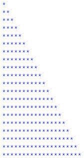
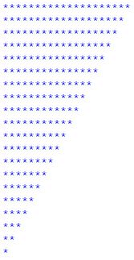

# Exercices d'application

###### 3.1. Exercice

```{admonition} Exercice
:class: warning
Demandez à l'utilisateur de saisir un nombre, puis utilisez une boucle while pour afficher la table de multiplication de ce nombre de 1 à 10.
```

###### 3.2. Exercice


```{admonition} Exercice
:class: warning
Demandez à l'utilisateur de saisir un nombre, puis utilisez une boucle while pour calculer la somme des carrés des nombres de 1 à ce nombre.
```

###### 3.3. Exercice

```{admonition} Exercice
:class: warning 
Codez un programme en utilisant la boucle while qui donne la factorielle d’un nombre.

Pour rappel, la factorielle est le réssultat de la multiplication de tous les nombres inférieurs ou égaux à un nombre donné.
```

###### 3.4. Exercice


```{admonition} Exercice
:class: warning 
Écrire un algorithme permettant d'afficher les nombres paires compris entre 0 et N, où N saisi par l'utilisateur. 

Indication : Utiliser la boucle while
```

###### 3.5. Exercice

```{admonition} Equation du premier degré ax+b=0
:class: warning 
1. Ecrire un programme qui permet de résoudre l’équation suivante :

$$
ax+b=0
$$

1.1. Le programme doit demander à l’utilisateur les paramètres a et b

1.2. Le programme doit afficher le résultat de la manière la plus sophistiquée possible. 

2. Écrire une fonction qui prend en argument deux nombres réels a et b qui retourne les solutions réelles de l’équation ax+b=0 quand elles existent et affiche une phrase indiquant qu’il n’y a pas de solutions réelles quand c’est le cas
```

###### 3.6. Exercice

```{admonition} Équation quadratique ax2+bx+c=0
:class: warning 
- Écrire une procédure qui prend en argument trois nombres réels a, b, c et qui retourne les solutions réelles de l’équation (1) quand elles existent et affiche une phrase indiquant qu’il n’y a pas de solutions réelles quand c’est le cas (on n’oubliera pas d’importer la fonction sqrt() du module math)

$$
ax^2+bx+c=0 ~~~~~~~~~(1)
$$

- Écrire une fonction qui prend en argument trois nombres réels a, b, c et qui retourne les solutions réelles de l’équation ax2+bx+c=0 quand elles existent et affiche une phrase indiquant qu’il n’y a pas de solutions réelles quand c’est le cas (on n’oubliera pas d’importer la fonction sqrt() du module math)
```

###### 3.7. Exercice


```{admonition} Exercice
:class: warning 

Ecrire un programme qui demande aux étudiant d’entrer les notes des modules suivants : math, informatique, français. Le programme doit afficher les éléments suivants :

- si les modules sont valides (note supérieure à 10).

- la moyenne des trois modules (moyenne = .5note_de_math + .4note_informatique + .1*note_francais)

- Excellent si la moyenne dépasse 18, très bien si la moyenne entre 16 et 18, bien si la moyenne entre 12 et 16, passable si la moyenne entre 10 et 12, non valide sinon.
```

###### 3.8. Exercice


```{admonition} Exercice
:class: warning 
Ecrire un programme qui permet d’afficher les 20 premiers nombres multiples de 3 avec while

Refaire le programme précédant avec la boucle for
```
###### 3.9. Exercice


```{admonition} Exercice de réflexion
:class: warning 
Ecrire un programme qui permet d’afficher le modèle suivant à l’aide d’une boucle :

1  
1 2  
1 2 3  
1 2 3 4  
1 2 3 4 5  
1 2 3 4 5 6  
1 2 3 4 5 6 7  
1 2 3 4 5 6 7 8  
1 2 3 4 5 6 7 8 9  
1 2 3 4 5 6 7 8 9 10  
1 2 3 4 5 6 7 8 9 10 11  
1 2 3 4 5 6 7 8 9 10 11 12  
1 2 3 4 5 6 7 8 9 10 11 12 13  
1 2 3 4 5 6 7 8 9 10 11 12 13 14  
1 2 3 4 5 6 7 8 9 10 11 12 13 14 15
```

```{admonition} Exercice
:class: warning 
Ecrire un programme qui permet d’afficher le modèle suivant à l’aide d’une boucle :


```


```{admonition} Exercice
:class: warning 
Ecrire un programme qui permet d’afficher le modèle suivant à l’aide d’une boucle :


```
