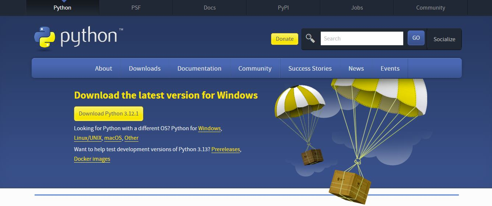
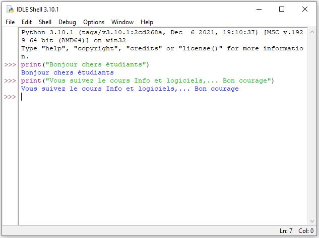

# Introduction
### 4 IA Management, HEC     
### Année universitaire 2024-2025
#### Prof. Jouilil Youness
##### Kenitra, Octobre 2024


```{admonition} Remarques
- Version de octobre 2024. En cours d’amélioration (à ne pas diffuser!)
- Support du cours d'Informatique, distribué gratuitement. 
- Merci de signaler les erreurs éventuelles!
```

```{admonition} Evaluation
- Devoir Surveillés (DS1, DS2, ...etc);
- Exposés;
- Devoirs libres;
- Travaux pratiques ;
- Assiduité et participation ;
- Examen Final.
```


```{admonition} Objectifs

- Compréhension des Fondamentaux de la Programmation 

- Compréhension de l'Écosystème Python

- Apprendre à manipuler différents types de données

- Pratique de la Résolution de Problèmes

- Compréhension des Concepts de Base de l'Analyse de Données

```

```{admonition} Python
:class: attention
Python est couramment utilisé, entre autres, pour le développement des sites Web et des logiciels, l’automatisation des tâches, machine learning, data science, l’analyse des données et la visualisation des données. 

Comme il est relativement facile à apprendre, Python a été adopté par de nombreux non-programmeurs tels que des comptables et des scientifiques, pour une variété de tâches quotidiennes, comme l’organisation des finances.

Le présent cours est une introduction à ce langage de programmation et à l'analyse de données sous Python. Il va être utile à toute personne désirant creuser davantage dans python pour attaquer l’une des disciplines susmentionnées. Il traitera les axes suivants :

- Introduction ;

- Eléments de base ;

- Instructions conditionnelles et boucles ;

- Types de données composites (chaines des caractères, listes, tuples, dictionnaires, ensembles);

- Analyse Statistique de Base;

- Visualisation de Données avec Matplotlib et Seaborn;

- Manipulation de Données avec Pandas.
```


```{admonition} Installer Python sur votre machine
:class: attention

Vous pouvez télécharger la dernière version de Python pour Windows sur `le site officiel de Python`.  https://www.python.org/downloads/




Une fois installation est terminée, vous pouvez utiliser `IDLE` (Integrated Development and Learning Environment), l’environnement de développement intégré de Python. Il est automatiquement installé lors de la configuration du langage de script. Pour ce faire, ouvrez la fonction de recherche de Windows et tapez « IDLE ». Vous démarrez IDLE shell à l’aide du résultat correspondant et pouvez vous lancer dans la programmation Python.



```

